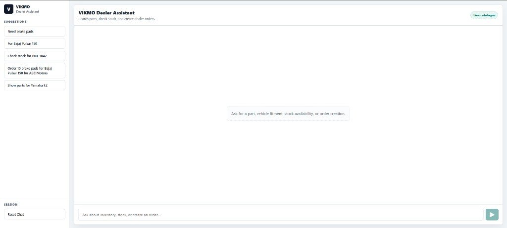
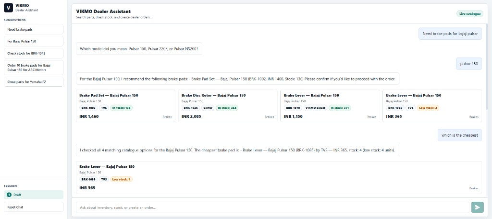
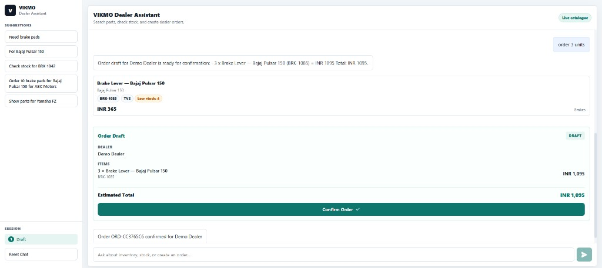
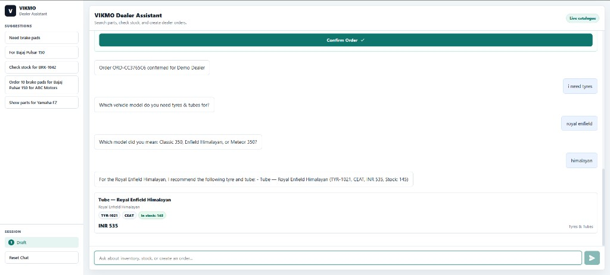
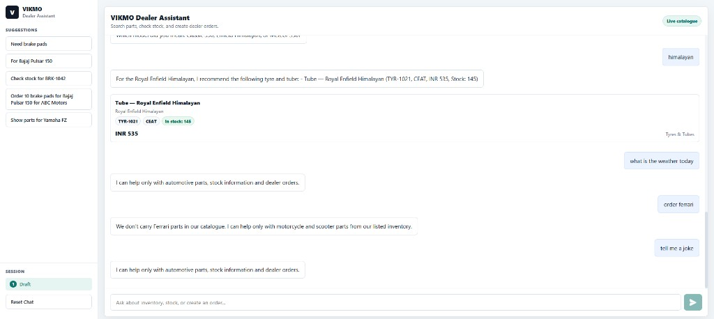
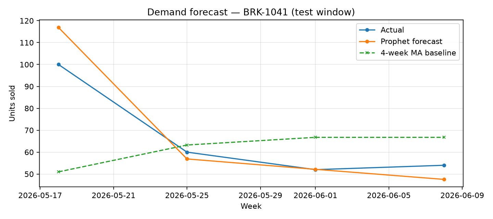

# Dealer Assistant

A conversational assistant for automotive dealers. Users can search parts, check stock, create order drafts, and continue multi-turn conversations. A separate forecasting module predicts weekly demand per SKU.

**Links:** [DESIGN.md](DESIGN.md) · [eval/results.md](eval/results.md) · [forecasting/results.md](forecasting/results.md)

## Screenshots

**Home**



**Part search and cheapest follow-up**



**Order draft and confirmation**



**Clarification (tyres → vehicle → model)**



**Guardrails (weather, unsupported make, off-topic)**



## Features

- Retrieval-augmented search over ~600 SKUs (ChromaDB + sentence-transformers)
- Tools for stock lookup, vehicle-based part search, and order creation
- Slot memory and clarification when vehicle or category is missing
- Guardrails for off-topic queries and unsupported vehicle makes
- 20-case evaluation suite (currently 20/20 passing)
- Demand forecasting: 4-week baseline vs Prophet

## Tech stack

- React + Flask
- LangGraph
- ChromaDB
- Sentence Transformers (`all-MiniLM-L6-v2`)
- Groq Llama 3.1
- Prophet

## Running locally

```bash
python -m venv .venv
.venv\Scripts\activate
pip install -r requirements.txt
copy .env.example .env     # Windows — optional Groq key
```

```bash
# Terminal 1
python server.py

# Terminal 2
cd frontend && npm install && npm run dev
```

Open http://localhost:3000

On first run the backend downloads the embedding model and builds the Chroma index from `catalogue.csv` (~1–2 minutes).

**Windows:** `start.bat` starts both servers.

**Streamlit UI:** `streamlit run ui/app.py`

## Example queries

```
Need tyres
→ Which vehicle model do you need tyres for?

Do you have brake pads for Bajaj Pulsar 150?
→ Lists matching parts with SKU, price, stock

Check stock for BRK-1042
→ Stock and price from catalogue

What's the cheapest chain lube you stock?
→ Cheapest matching product

Order 10 units for ABC Motors   (after discussing a part)
→ Order draft with line total

What's the weather today?
→ Polite refusal
```

Multi-turn:

```
Show tyres for Royal Enfield Himalayan
which one is the cheapest
how many in stock?
```

## Evaluation

```bash
python -m eval.run_eval
```

Latest results: **20/20 cases passed**, tool and grounding accuracy at 1.0, retrieval hit rate@3 at 0.78. Details in [eval/results.md](eval/results.md).

## Forecasting

```bash
python -m forecasting.evaluate
```

Prophet (MAE 5.81) beats a 4-week moving average baseline (MAE 7.86) on a chronological holdout. Not connected to the chatbot — see [forecasting/results.md](forecasting/results.md).

Plot the test-window forecast (from project root):

```bash
python -m forecasting.evaluate
python -m forecasting.plots --sku BRK-1041
```



## Project layout

```
assistant/     LangGraph agent, retrieval, tools
frontend/      React chat UI
eval/          Test cases and metrics
forecasting/   Baseline + Prophet
ui/            Streamlit UI
catalogue.csv  Product data
sales_history.csv
server.py
```

## License

MIT
